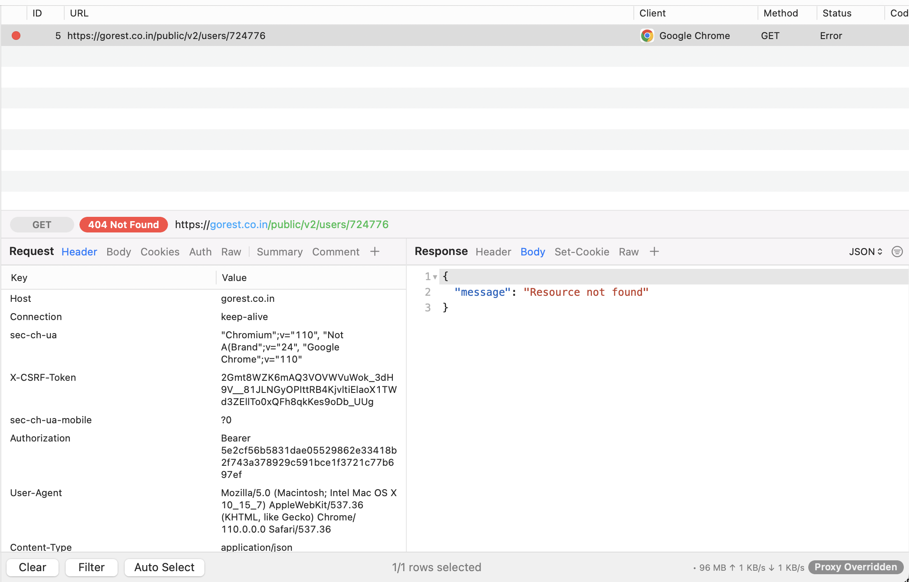

# Breadfast Mobile Task - iOS

# Task description

Write a sample social mobile application that contains 3 screens:
- Splash screen 
- Home (List of posts) Post details
- Post card should contains:
    - User Name 
    - User Avatar
    - Title
    - Content
- Post details page should contains:
    - User Name
    - User Avatar
    - Title
    - Content
- List of comments:
    - Comment card should contains:
        - User 
        - Name 
        - User 
        - Avatar
        - Content
        
Check posts/comments services on: https://gorest.co.in/
List posts from: https://gorest.co.in/public/v2/posts
When user click on post card show details page with the post on top and list of comments below

# Solution

## Estimation
10 hours

## Architecture
The whole app splitted into 3 layers:
- Domain
- Data
- Presentation

`Domain` and `Data` layers implemeted as local SPM packages, that connected to the main target. Presentation layer implemented via MVVM+C architecture. Navigation between screens implemented via `Coordinator` pattern. Layout for cells, view controllers implemented with Storyboard/Xib files.

API credentials (token and base URL) defined in `Config` file inside `Configurations` folder

## Dependencies
- Alamofire for network communication

## How to run project
- Clone project
- Open `Breadfast_posts` folder
- Open `Breadfast_posts.xcodeproj` in Xcode
- Select desired simulator and press `Run` button

## Known issues

Endpoint `GET /public/v2/users/specific_user_profile_id`
    - this endpoint don't return following fields:
        - avatar
    - a lot of users with id's from `https://gorest.co.in/public/v2/posts` simply not exist. So `GET /public/v2/users/specific_user_profile_id` will return 404 code. In that case app will display *placeholder* user profile with `name: "User not found" and email: "example@email.com"`
    
Details in screenshots below:

## Screenshots

