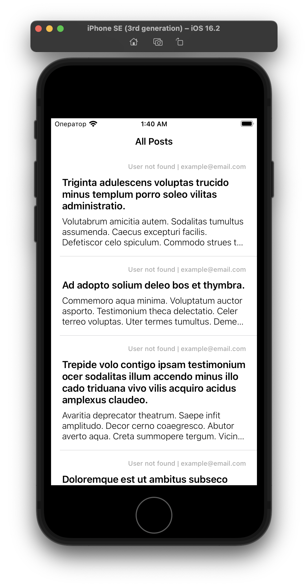

# breadfast_test_task

# Architecture
The whole app splitted into 3 layers:
- Domain
- Data
- Presentation

Domain and Data layers implemeted as local SPM packages, that connected to the main target.

Presentation layer implemented via MVVM+C architecture. Navigation between screens implemented via `Coordinator` pattern. Layout for cells, view controllers implemented with Storyboard/Xib files.

# Dependencies
- Alamofire for network communication

# Screenshots

